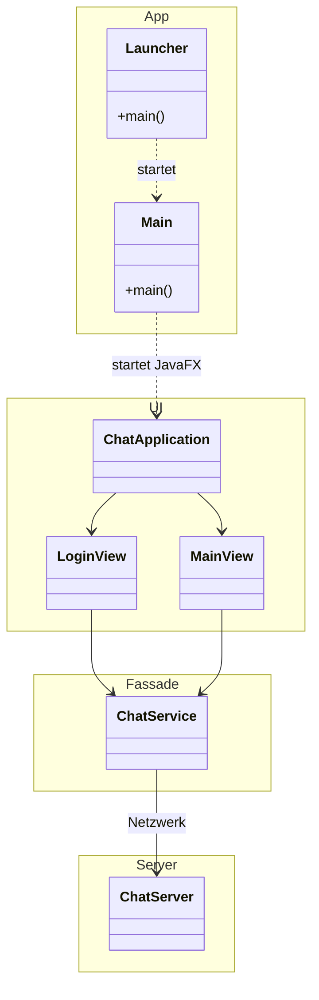

# 💬 JavaFX Client-Server Chat (MyLocalChat)


> Eine lokale Chat-Anwendung, basierend auf einer **Client-Server-Architektur**, entwickelt mit **Java 17** und **JavaFX**.

---

## 📖 Übersicht

Dieses Projekt demonstriert die Umsetzung von Netzwerkkommunikation (Sockets), GUI-Entwicklung mit JavaFX und einer sauberen Schichtentrennung (Layered Architecture).

### 🚀 Features

* **📡 Client-Server Kommunikation:** Echtzeit-Nachrichtenaustausch über TCP-Sockets.
* **👤 Benutzerverwaltung:** Login-System und User-Tracking.
* **💬 Chat-Räume:**
    * *Privatchats* (`UserChatRoom`)
    * *Gruppenchats* (`GruppenRoom`)
* **🎨 Modernes UI:** Grafische Oberfläche erstellt mit JavaFX.
* **📦 Datenmodelle:** Strukturierte Verarbeitung von Nachrichten (`MessageType`).

---

## 📸 Screenshots

Hier ein Einblick in die Anwendung:

### Login & Setup
<p align="center">
  
</p>

### Chat Ansicht
<p align="center">
  
</p>

---

## 🏗 Architektur & Design

Das Projekt ist in verschiedene Schichten unterteilt, um Logik, UI und Datenhaltung zu trennen.



### 📂 Projektstruktur

| Paket | Beschreibung |
| --- | --- |
| **`app`** | Enthält den `Launcher` (für Fat-Jars) und die `Main`-Klasse. |
| **`ui`** | Die grafische Oberfläche (Views und Controller). |
| **`fassade`** | Die `ChatService`-Klasse dient als Schnittstelle zwischen UI und Logik. |
| **`domain`** | Die Geschäftslogik (User, Nachrichten, Manager-Klassen). |
| **`server`** | Die Server-Implementierung für die Netzwerkverbindung. |

---

## 🛠 Technologien

* **Sprache:** Java JDK 17
* **GUI Framework:** JavaFX 17
* **Build Tool:** Maven
* **Testing:** JUnit 5

---

## ⚙️ Installation & Start

### Voraussetzungen

Stelle sicher, dass **Java 17** und **Maven** installiert sind.

### 1. Repository klonen

```bash
git clone [https://github.com/ObaiAlbek/JavaFX-Client-Server-Chat.git](https://github.com/ObaiAlbek/JavaFX-Client-Server-Chat.git)
cd JavaFX-Client-Server-Chat

```

### 2. Projekt bauen

```bash
mvn clean install

```

### 3. Starten

Da es sich um ein Client-Server-System handelt, ist die Reihenfolge wichtig:

**Schritt A: Server starten**
Führe die `ChatServer`-Klasse im Paket `server` aus.

**Schritt B: Client starten**
Führe die `Launcher`-Klasse im Paket `app` aus (beliebig viele Clients möglich).

---

## 📝 Lizenz

Dieses Projekt wurde zu Bildungszwecken erstellt.
